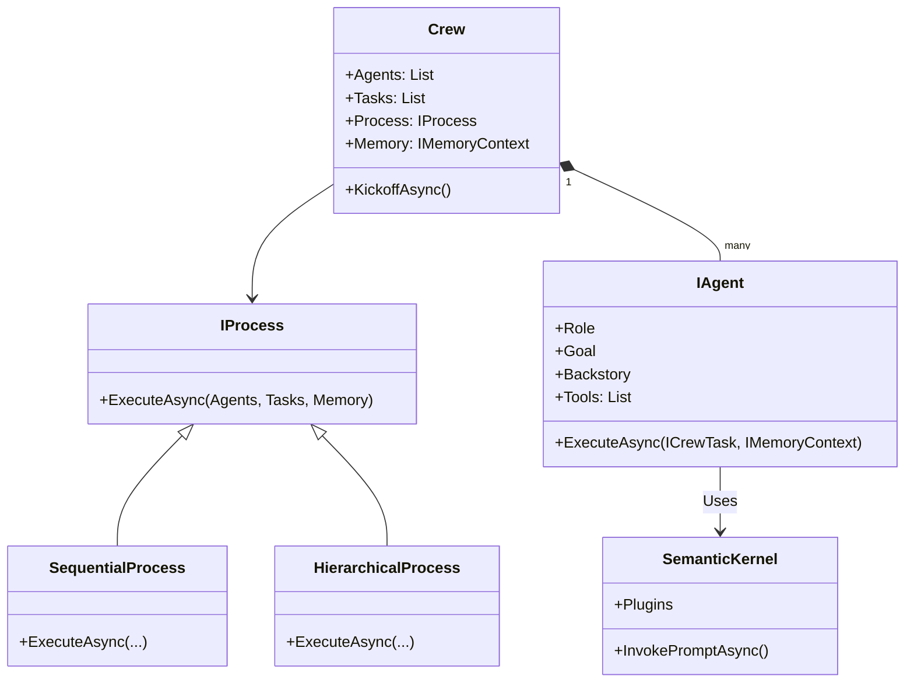

# Architecture Overview

Agents Crew is designed as a modular, extensible framework built on top of Microsoft's **Semantic Kernel**.

## Project Structure

- **Core (`AgentsCrew.Core`):**
    - **Models:** `Agent`, `CrewTask`, `Crew`
    - **Interfaces:** `IAgent`, `ICrewTask`, `ICrew`, `IProcess`, `IMemoryContext`
    - **Process:** `SequentialProcess`, `HierarchicalProcess`, `AgentManager`
    - **Memory:** `ShortTermMemory`, `LongTermMemory`, `EntityMemory`
    - **Configuration:** `YamlConfigurationLoader`
    - **Plugins:** `DelegationPlugin`, `AgentCreationPlugin`
    - **Events:** `IEventSystem`
    - **Builders:** Fluent API (`AgentBuilder`, etc.)

- **Tools (`AgentsCrew.Tools`):**
    - Standard tool implementations (`FileTool`, `WebSearchTool`).
    - Depends on `Core` interfaces.

- **Example (`AgentsCrew.Example`):**
    - Console application demonstrating usage.
    - Includes `MockChatCompletionService` for testing without API keys.

- **Tests (`AgentsCrew.Tests`):**
    - Unit and integration tests using xUnit.

## High-Level Diagram

## Key Flows

1.  **Initialization:**
    - User builds Agents using `AgentBuilder`.
    - User builds Crew using `CrewBuilder`, adding Agents and Tasks.
    - `CrewBuilder` initializes Memory (Semantic/ShortTerm/Entity).

2.  **Execution (Sequential):**
    - `Crew.KickoffAsync()` calls `Process.ExecuteAsync()`.
    - `SequentialProcess` iterates through Tasks.
    - For each Task, `Agent.ExecuteAsync()` is called.
    - Agent retrieves context from Memory -> constructs prompt -> invokes LLM via Semantic Kernel.
    - Result is stored in Memory for the next Task.

3.  **Execution (Hierarchical):**
    - `HierarchicalProcess` assigns tasks to a Manager Agent.
    - Manager Agent uses `DelegationPlugin` (via LLM tool call) to assign work to other agents.
    - Sub-agents execute and return results to Manager.
